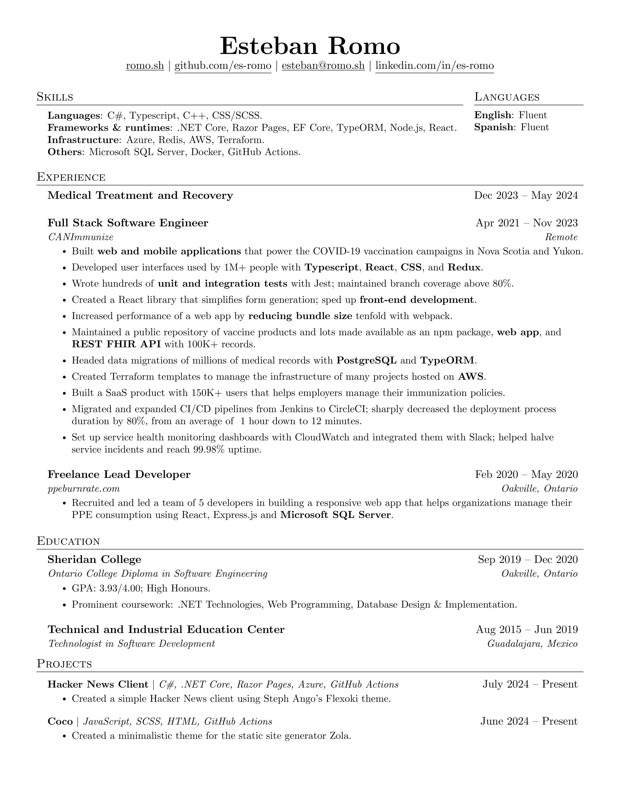

# Resume
LaTeX template for my personal resume.

Based off of [jakegut/resume](https://github.com/jakegut/resume/).

# Requirements
 - A LaTeX distribution. [TeX Live](https://www.tug.org/texlive/) preferably but [Tiny TeX](https://yihui.org/tinytex/) should work too.
 - [ImageMagick](https://imagemagick.org/index.php) version 6.9.11-60 or newer.
 - [GhostScript](https://www.ghostscript.com/). Necessary at least in Windows. Seems to already be included with ImageMagic for Mac and Linux.

# Set up
 - Create a symlink for the pre-commit hook `ln -f -s ../../hooks/pre-commit .git/hooks/pre-commit`.
 - Make the pre-commit hook executable `chmod +x hooks/pre-commit`.
